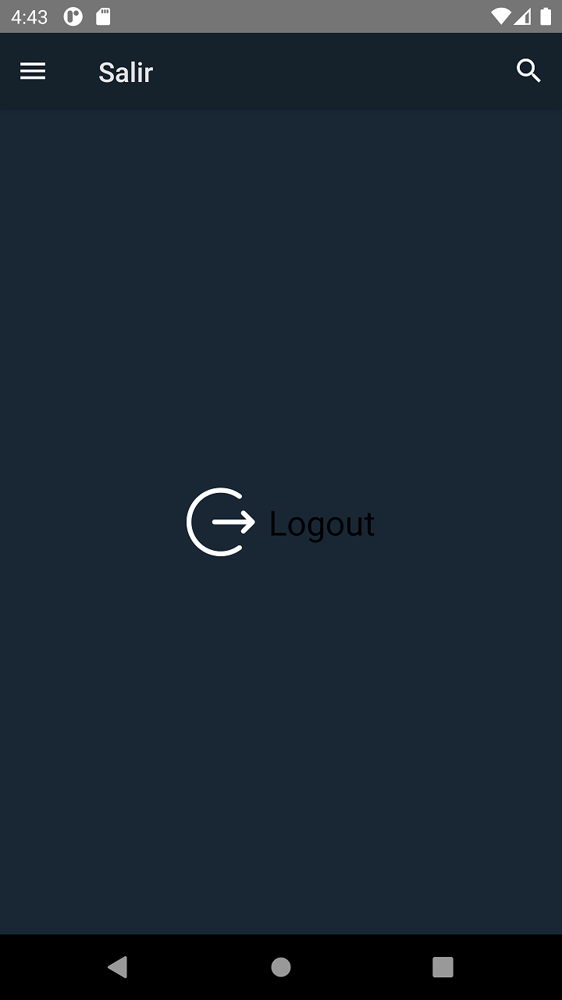
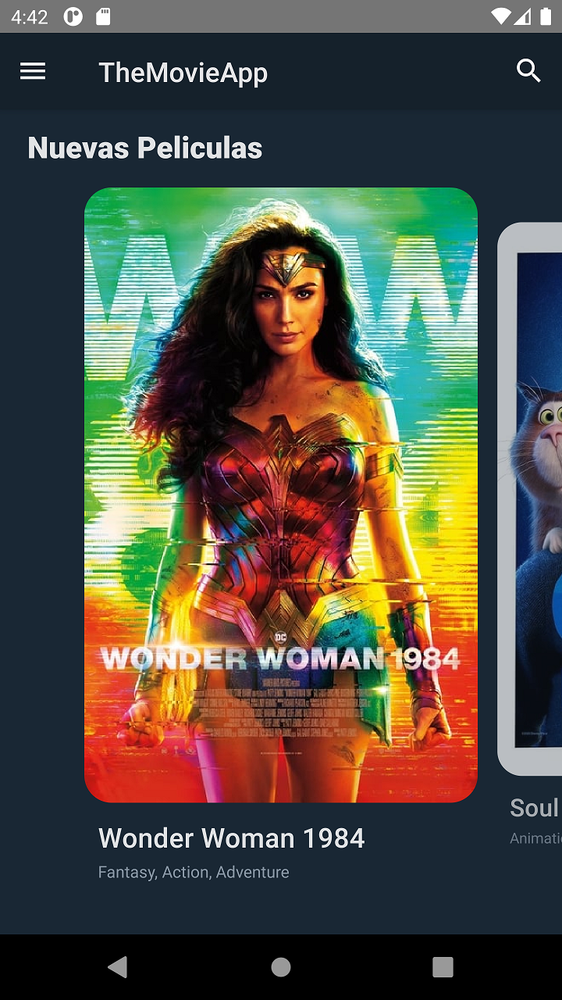
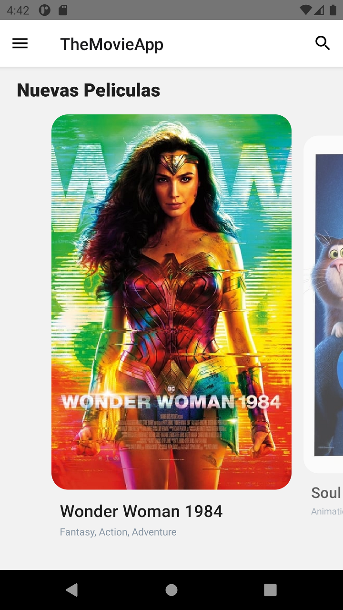
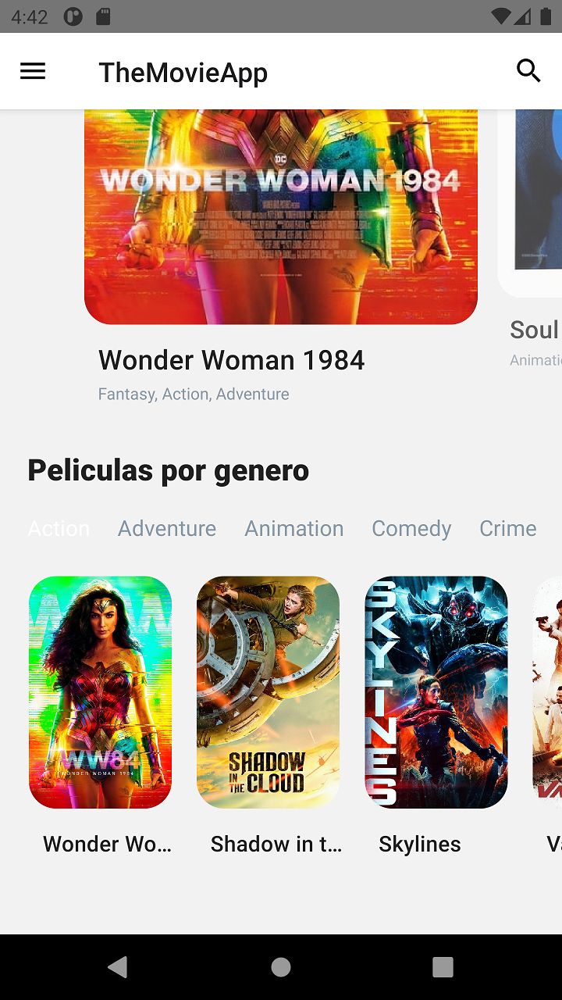
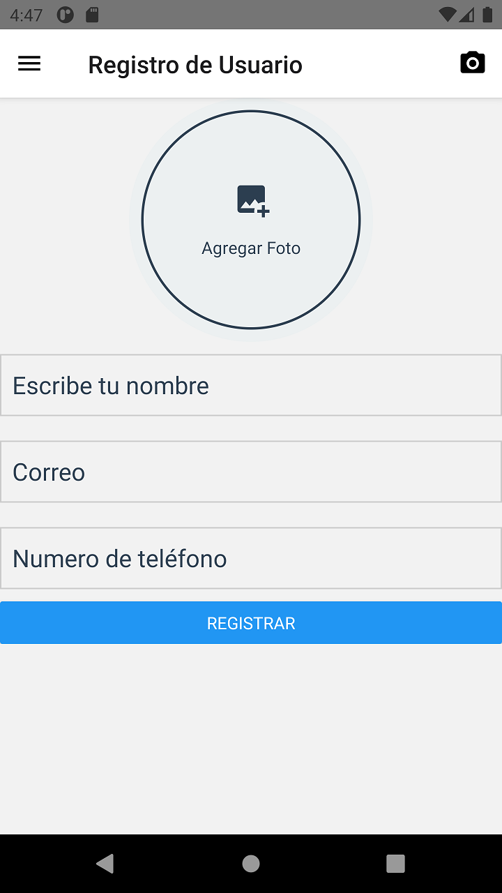

# Desarrollo de Proyecto mobile con React Native

Este proyecto tiene como objetivo poder realizar una APP mobile con react native como desarrollo de la actividad del curso de React Native Escalab. Esta APP tiene como objetivo principal poder consumir la API de https://www.themoviedb.org/

Las credeciales para iniciar el proyecto son:

```
**Usuario:** test.
**Password:** test.

```
### Imagen de Login

  


### Imagen de Logout

  


### Imagen de Inicio

  

  


### Imagen de la Pelicula

  

### Imagen de Nuevas Peliculas

  


### Imagen de busqueda Peliculas


### Imagen de Registro de Usuarios


  

  

 


### Imagen de panel lateral


  


## Creación carpeta proyecto

```
npx create-react-app themoviedb
cd themoviedb
```

## Desarrollo de dependencias

```
Run:

$ npm i react-native-paper
$ npm i --save react-native-vector-icons
$ npm i @react-navigation/native
$ npm i react-native-reanimated react-native-gesture-handler react-native-screens react-native-safe-area-context @react-native-community/masked-view
$ npm i @react-navigation/stack
$ npm i react-native-snap-carousel
$ npm i -g npm
$ npm i --save lodash
$ npm i react-native-youtube
$ npm install --save react-native-webview
$ npm i react-native-ratings

$ npm i react-redux redux
$ npm i redux-thunk  
$ npm i @react-native-async-storage/async-storage
$ npm i react-native-keyboard-aware-scroll-view
$ npm i react-native-loading-spinner-overlay
$ npm i @react-navigation/bottom-tabs

```

## Modulo Babel

```
module.exports = {
  presets: ['module:metro-react-native-babel-preset'],
  env: {
    production: {
      plugins: ['react-native-paper/babel'],
    },
  },
};
```

## Ejecución Proyecto

```
$ npx react-native run-android 
```


## Desarrollo de archivo  utils/constants.js

El desarrollo de la API_KEY es de la API de https://www.themoviedb.org/

### Valores de las constantes utilizadas
```
export const API_KEY = '<API_KEY>';
export const API_HOST = 'https://api.themoviedb.org/3';
export const LANG = 'es-ES';
export const BASE_PATH_IMG = 'https://image.tmdb.org/t/p';
```


## Instalar camara Solo Android

```
npm i react-native-camera
```

```
../android -> app -> src -> buils.gradle

 defaultConfig {
        applicationId "com.themoviedb"
        minSdkVersion rootProject.ext.minSdkVersion
        targetSdkVersion rootProject.ext.targetSdkVersion
        versionCode 1
        versionName "1.0"
        missingDimensionStrategy 'react-native-camera', 'general'
        multiDexEnabled true
    }
```

##  En caso de Error (una posible solución)

error Failed to install the app. Make sure you have the Android development environment set up: https://reactnative.dev/docs/environment-setup. Run CLI with --verbose flag for more details.
Error: Command failed: gradlew.bat app:installDebug -PreactNativeDevServerPort=8081


Ejecutar

```
npx --quiet react-native config  
npx.cmd --quiet react-native config

npm install

Ejecutar 
$ npx react-native run-android 
```


## Revisar logs 

```
git log --pretty=oneline
```
## Cargar cambios y versiones

```
git branch -M main
git push -u origin main

           (Version) 
git tag -a V1.0.0 -m "Mensaje"
git push --tags
```


## Desinstalar posiblemente

npm i react-native-animatable
npm i axios
npm i react-native-gesture-handler
npm i react-native-reanimated
npm i react-native-svg
npm i react-native-svg-charts