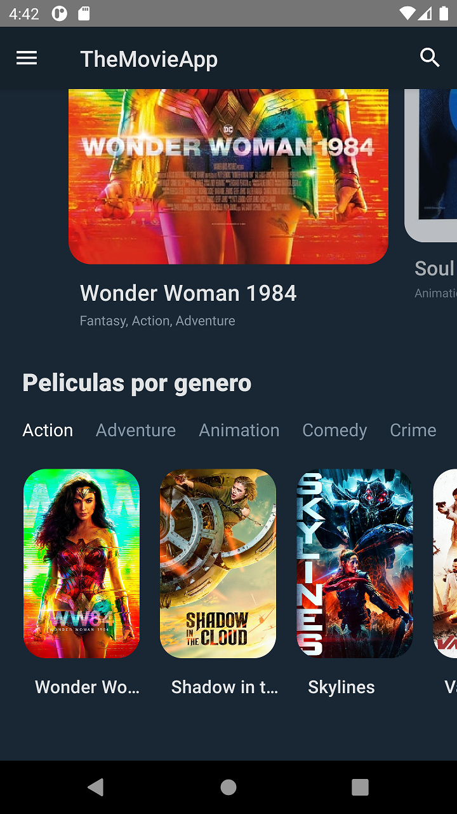

# Desarrollo de Proyecto mobile con React Native

Este proyecto tiene como objetivo poder realizar una APP mobile con react native como desarrollo de la actividad del curso de React Native Escalab. Esta APP tiene como objetivo principal poder consumir la API de https://www.themoviedb.org/

### Imagen de Inicio


### Imagen de Peliculas Populares



### Imagen de la Pelicula


### Imagen de Nuevas Peliculas


## Creación carpeta proyecto

```
npx create-react-app themoviedb
cd themoviedb
```

## Desarrollo de dependencias

```
Run:

$ npm i react-native-paper
$ npm i --save react-native-vector-icons
$ npm i @react-navigation/native
$ npm i react-native-reanimated react-native-gesture-handler react-native-screens react-native-safe-area-context @react-native-community/masked-view
$ npm i @react-navigation/stack
$ npm i react-native-snap-carousel
$ npm i -g npm
$ npm i --save lodash
$ npm i react-native-youtube
$ npm install --save react-native-webview
$ npm i react-native-ratings
```

## Modulo Babel

```
module.exports = {
  presets: ['module:metro-react-native-babel-preset'],
  env: {
    production: {
      plugins: ['react-native-paper/babel'],
    },
  },
};
```

## Ejecución Proyecto

```
$ npx react-native run-android 
```


## Desarrollo de archivo  utils/constants.js

El desarrollo de la API_KEY es de la API de https://www.themoviedb.org/

### Valores de las constantes utilizadas
```
export const API_KEY = '<API_KEY>';
export const API_HOST = 'https://api.themoviedb.org/3';
export const LANG = 'es-ES';
export const BASE_PATH_IMG = 'https://image.tmdb.org/t/p';
```